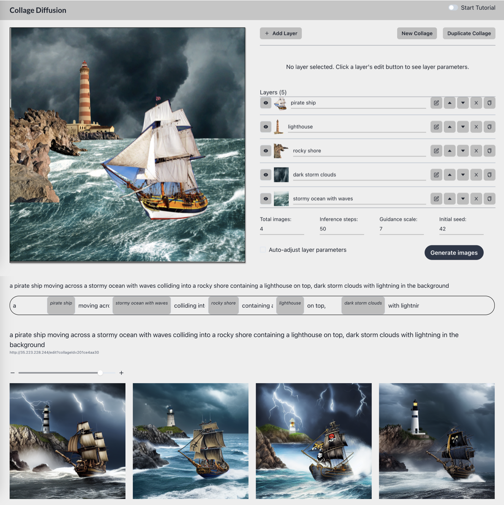

# Collage Diffusion UI

<p align="center">
  <a href="http://collagediffusion.stanford.edu">
    [Demo Website]
  </a>
  <a href="https://vsanimator.github.io/collage_diffusion/">[Blog Post]</a>
  <a href="https://www.youtube.com/watch?v=BX4ZW9M_bmo">[Video Tutorial]</a>
  <a href="https://arxiv.org/abs/2303.00262">[Paper]</a>
</p>
<p align="center">
    <picture>
      
    </picture>
</p>

Collage Diffusion is a novel interface for interacting with image generation models. It allows you to specify the composition of an image in a familiar Photoshop-like interface. Our modified version of Stable Diffusion takes the layers in and produces a harmonized image, ensuring that everything from perspectives to lighting are plausible. Unlike text prompting supported by traditional diffusion interfaces, Layered Diffusion allows you to precisely outline how a scene should be composed—from where objects are relative to each other to what they look like.

The frontend is a React app written in Typescript using the [Chakra UI](https://chakra-ui.com/) library. The server implements a custom scheduler runtime that dispatches requests to the [Ray Serve](https://docs.ray.io/en/latest/serve/index.html) library for inference. The model is a modified version of Stable Diffusion via [HuggingFace Diffusers](https://github.com/huggingface/diffusers).

# Development Setup

Create a configuration file by running

```bash
./configure.sh config_dev.json
```

## Frontend

The frontend is a React App written in Typescript, with UI components from Chakra UI. All code is placed in the `frontend` directory. To setup locally, make sure you've installed `node` and `npm`. Setup dependencies by running the following commands:

```bash
cd frontend
npm install
```

The app is built using `vite`. To start the app, run:

```bash
npm start
```

and navigate to `http://localhost:5173`. If you want to deploy, run

```bash
./start.sh frontend
```

which will build the app and serve it on port 3000.

## Server

The server hosts a modified version of Stable Diffusion v1.5 from the HuggingFace diffusers library. Inference is best run on a node with GPUs. The model weights take approximately 8 GB of GPU VRAM, so most GPUs (NVIDIA A100, A10G, V100, etc.) should be able to handle the workload without running out of memory.

We provide a configuration file in `configs/config_gcp.json` that allows you to configure the ports that the app is run on. A crucial field is `backend.activeGpus`, which adjusts the `CUDA_VISIBLE_DEVICES` environment variable within the application container.

We provide a Dockerfile containing all of the dependencies to run the server. To build the image, run

```bash
docker build -t collage-diffusion .
```

from the project root directory. This will create an image called `layered-diffusion`, which you can use to run the server by running:

```bash
docker run -d --gpus all --ipc=host --ulimit memlock=-1 --ulimit stack=67108864 -p 8009:8009 -p 9007:9007 collage-diffusion
```

If you modified the ports in the config file above, then be sure to adjust the forwarded port accordingly.

### Setting up Google Cloud

Our service uploads to a Google Cloud Bucket. To use your own custom bucket, navigate to `backend/utils/gcloud_utils.py` and modify the `PROJECT_ID` and `BUCKET_NAME` variables accordingly.

Install the Google Cloud storage package:

```
pip install google-cloud-storage
```

After that, install the Google Cloud SDK. You can do this by running the following command:

```
curl -O https://dl.google.com/dl/cloudsdk/channels/rapid/downloads/google-cloud-cli-417.0.0-linux-x86_64.tar.gz
tar -xf google-cloud-cli-417.0.0-linux-x86_64.tar.gz
```

Install via:

```
./google-cloud-sdk/install.sh
```

After installation, restart your shell. Then, run the following commands:

```
./google-cloud-sdk/bin/gcloud init
```

which will prompt you to log in to your Google account. Select your project.

You will then have to login using:

```
gcloud auth application-default login
```

To test that uploading to GCP works, run the following command:

```
python backend/utils/gcloud_utils.py -f {path_to_file}
```

where `{path_to_file}` is a path to a file you want to upload. If the file successfully uploaded, you should see a link to the file in the console.

# Acknowledgements

This project was done under the supervision of [Prof. Chris Re](https://cs.stanford.edu/~chrismre/) and [Prof. Kayvon Fatahalian](http://graphics.stanford.edu/~kayvonf/). The implementation and design of the system was done by [Vishnu Sarukkai](https://vsanimator.github.io/), [Arden Ma](https://www.linkedin.com/in/ardenma/), and [Linden Li](https://linden-li.github.io).
